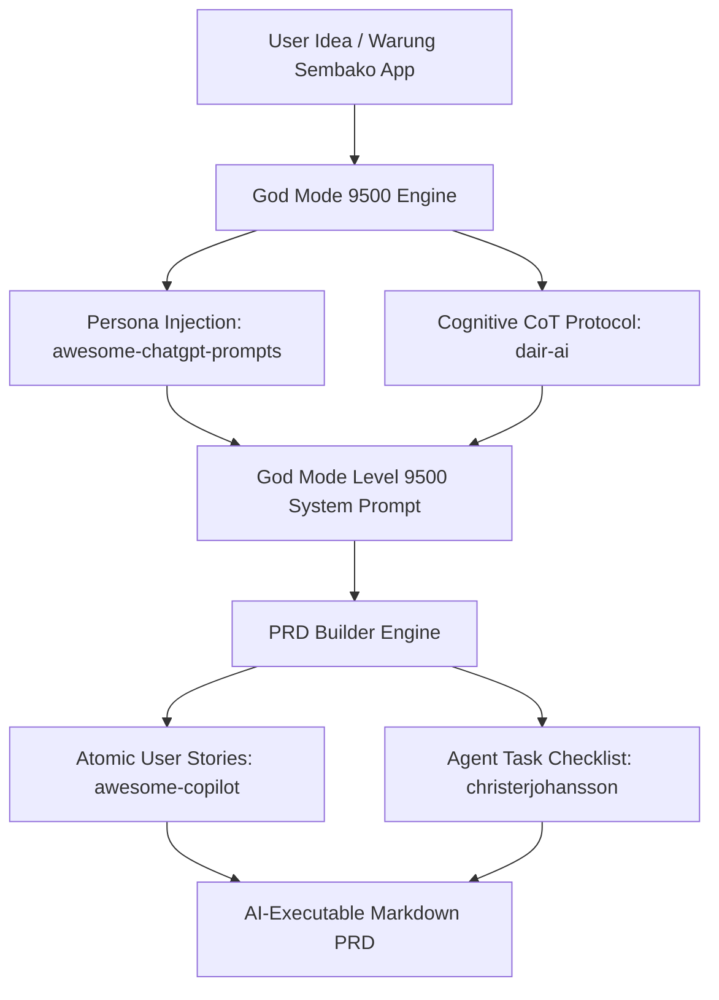

# 🧬 GOD MODE 9500 — PROMPT & PRD ENGINEERING MANIFESTO

God Mode 9500 is engineered by internalizing the four foundational open-source repositories that define modern AI prompt engineering and autonomous product development. 

Below is the scientific blueprint and mapping of how our AI engines (`godmodeEngine.ts` & `useGodMode.ts`) integrate these world-class methodologies.

---

## 1. The Science of Prompt Engineering
**Source Repository:** [`dair-ai/Prompt-Engineering-Guide`](https://github.com/dair-ai/Prompt-Engineering-Guide)  
**Focus:** Academic rigor, structured cognitive frameworks, and reasoning algorithms.

### Internalized Mechanics:
- **Chain-of-Thought (CoT) & Tree-of-Thoughts (ToT):** Every God Mode system prompt strictly forces AI models to execute sequential domain decomposition before generating code or specifications.
- **Few-Shot Calibration Anchors:** We calibrate AI responses by providing concrete positive exemplars alongside edge-case boundary resolutions.
- **Self-Consistency Loops:** All outputs pass through our 10-dimension evaluator (Level 9500 scoring gate) to eliminate hallucinations and verify constraint compliance.

---

## 2. Persona Injection & Role-Playing Authority
**Source Repository:** [`f/awesome-chatgpt-prompts`](https://github.com/f/awesome-chatgpt-prompts)  
**Focus:** Domain specialist personas and authoritative behavioral framing.

### Internalized Mechanics:
- **Calibrated Expert Identity:** Instead of generic system instructions ("You are a helpful AI"), God Mode initializes every prompt with a specialized identity (e.g., *Senior POS & Retail Inventory Architect*, *Lead Database & RLS Security Auditor*).
- **Epistemic Invariants:** Explicit rules defining what the persona knows, what standard methodologies it must enforce, and what guesswork is strictly prohibited.

---

## 3. AI-Executable Product Requirements Documents (PRDs)
**Source Repository:** [`christerjohansson/ai-product-requirement-document`](https://github.com/christerjohansson/ai-product-requirement-document)  
**Focus:** AI-driven development workflows structured for autonomous agent IDEs (Cursor, Claude, Antigravity).

### Internalized Mechanics:
- **Machine-Parseable Structure:** Our PRD Builder generates structured Markdown designed explicitly for agent parsers rather than traditional Word documents.
- **Agent Executable Task Checklists (`[ ]`):** PRDs culminate in hierarchical, dependency-ordered Markdown TODO lists that AI agents can directly iterate over and execute without manual human prompting.

---

## 4. Rigorous Specification Standards
**Source Repository:** [`github/awesome-copilot`](https://github.com/github/awesome-copilot) (`skills/breakdown-feature-prd`)  
**Focus:** GitHub Copilot specification standards breaking features into atomic units.

### Internalized Mechanics:
- **Strict User Story Syntax:** Every feature in God Mode PRDs is broken down into precise `As a [role], I want [action], so that [benefit]` definitions.
- **Binary Acceptance Criteria:** Features require testable Given/When/Then conditions and explicit latency/performance SLAs (<1.2s FCP, <500ms API response).

---

## Summary of Architectural Flow

